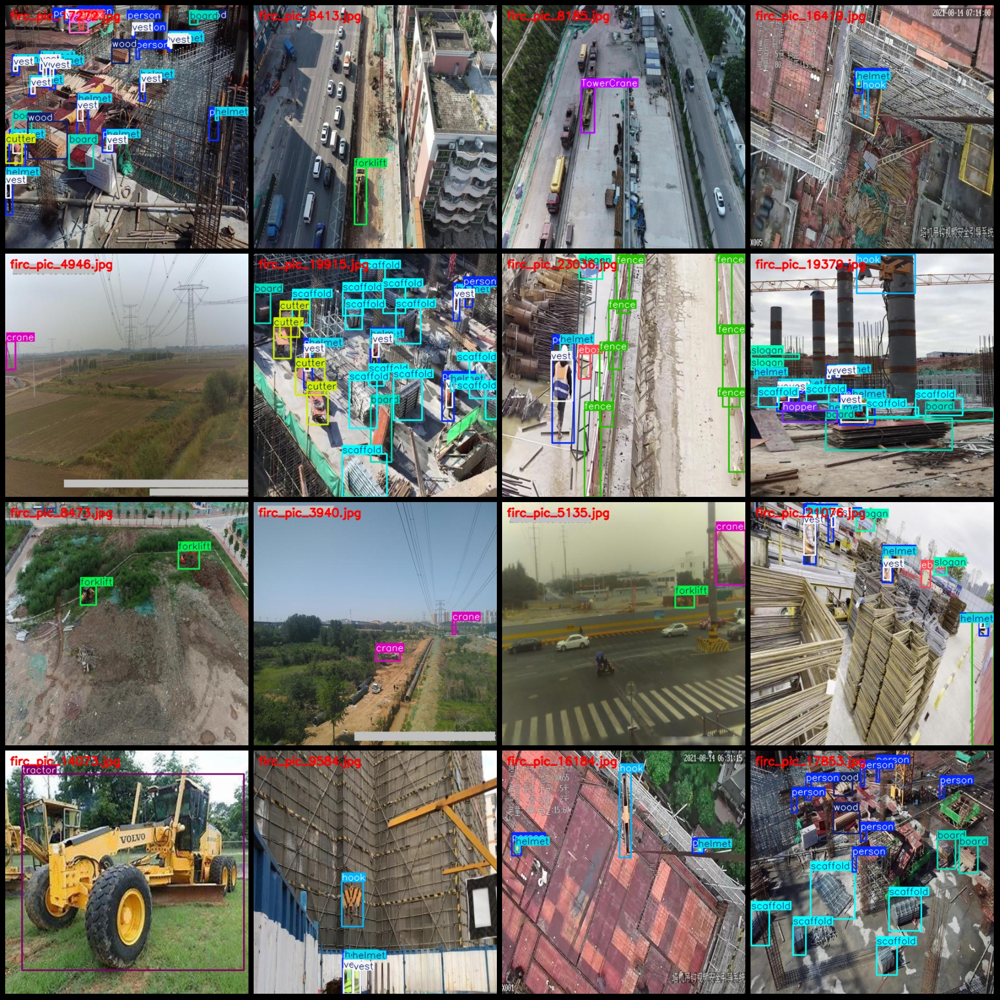
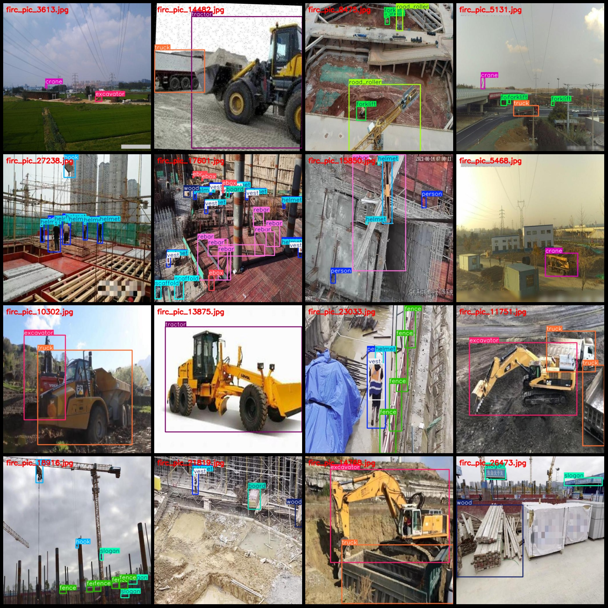

# Dataset for Building Site Construction Machinery, Personnel, Materials and Construction Elements Target Detection in VOC+YOLO Format with 27,278 Images from 26 Categories

Dataset format: Pascal VOC format + YOLO format (txt files without split paths, only containing jpg images and corresponding VOC format xml files and yolo format txt files)
Number of images (jpg file count): 27278
Number of annotations (xml file count): 27278
Number of annotations (txt file count): 27278
Number of annotative categories: 26
Annotative category names in yolo format (note that the order of categories in the yolo format does not correspond to this list, but is based on the labels folder's classes.txt): ["BirdCarcass", "ForeignObject", "PileDriver", "TowerCrane", "board", "brick", "concrete_mixer_truck", "crane", "cutter", "ebox", "excavator", "fence", "forklift", "handcart", "helmet", "hook", "hopper", "person", "rebar", "road_roller", "scaffold", "slogan", "tractor", "truck", "vest", "wood"]
Box numbers for each category annotation:
BirdCarcass box number = 65
ForeignObject box number = 15
PileDriver box number = 822
TowerCrane box number = 12190
board box number = 8347
brick box number = 2246
concrete_mixer_truck box number = 1270
crane box number = 15082
cutter box count = 1203
ebox box count = 5629
excavator box count = 5830
fence box count = 5588
forklift box count = 3072
handcart box count = 831
helmet box count = 37256
hook box count = 5649
hopper box count = 3516
person box count = 48865
rebar box count = 4483
road_roller box count = 372
scaffold box count = 17241
slogan box count = 12227
tractor box count = 3528
The truck has a frame count of 7586.
The vest box count is 31474.
This is a very large number. It's probably the result of a calculation or measurement. What was it used for?
Total number of frames: 246094
Number of images per category:
BirdCarcass images = 28  
ForeignObject images = 14
PileDriver images = 467
Tower cranes (tower cranes) have 3613 images.
board images = 4211  
brick images = 1146  
concrete_mixer_truck images = 984  
crane images = 5892  
"Cutter" is a type of machine used for cutting materials. The number "847" could refer to the quantity of images or data that have been cut by this machine. However, without more context, it's not clear what kind of image or data is being referred to.
The eBox (electric box/electrical box) occupies a picture count of 3329.
Excavator
1. A barrier that encloses a piece of land or property.
2. The boundary between two pieces of land or property.
3. Forklift (Fork-lift)
A handcart is a small cart that is pulled by hand. It is often used in construction, agriculture, and other industries where manual labor is needed.
5. Helmet
6. Hook
7. Hopper
8. Person
9. Rebar
10. Road roller
1. Scaffolding
"Together we can change the world."
13. Tractor
14. Truck
Vest
Wood has 4214 images.
Image resolution: 512x512
## Image

Here is a pay link on Stripe ( https://buy.stripe.com/3cs8yP7sY87d0vu9AB ). Please contact me lonlonago@foxmail.com after funding $89, and I will send you a complete data files , thank you!

